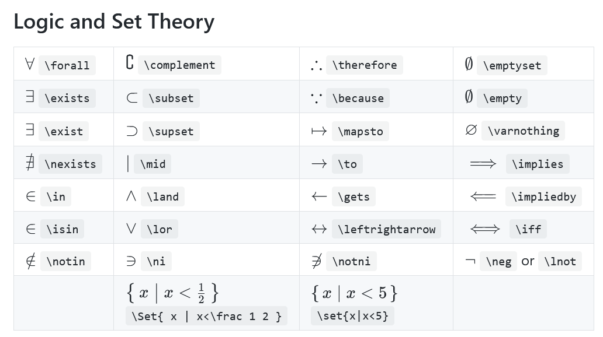

# Conceitos

## Tópicos de Estudo
- Conjunto
- Conjuntos Numéricos
- Subconjuntos
- Operações com conjuntos
- Diagramas de Venn
- Intervalos

## Cardinalidade de Conjuntos
- $ \text{card(A)} = o(A) = n(A)$
	- sendo:
		- $ A $ := um conjunto qualquer

## Operações entre conjuntos
- Symbools:

- Sendo:
	- $ A = {1, 2, 3} $
	- $ A = {2, 3, 4} $
	- $ A = {3, 4, 5, 6} $

### Union
$ A $

### Inersection
$ $

### Diference
$ $